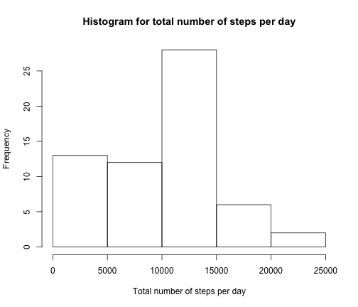
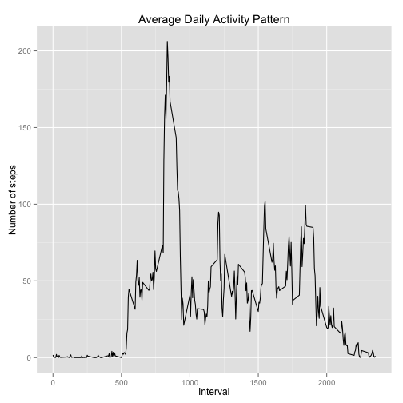
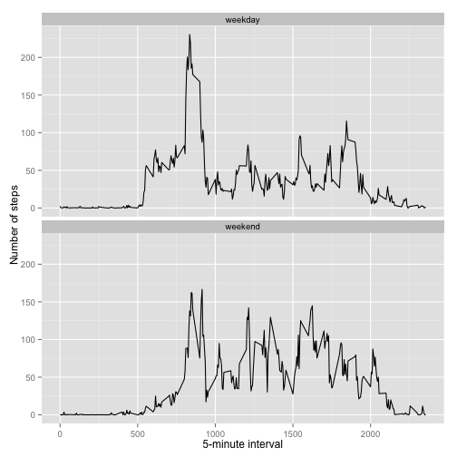

Reproducible Research: Peer Assessment 1
========================================================

## Loading and preprocessing the data
First the data, present in a csv file, is loaded. No further processing is needed.


```r
data <- read.csv("activity.csv", header=TRUE, na.strings="NA", stringsAsFactors=FALSE)
```

## What is mean total number of steps taken per day?
From the original data the total number of steps (sum) per day is calculated and stored.


```r
plot_data <- tapply(data$steps, data$date, FUN=sum, na.rm=TRUE)
```

Now a histogram (frequency per bin of steps per day) is plotted. No further processing of the histogram is done (for example manipulating the number of bins)


```r
hist(plot_data, main = "Histogram for total number of steps per day", xlab = "Total number of steps per day")
```

 

Also the mean and the median of the total number of steps per day is calculated.


```r
mean(plot_data)
```

```
## [1] 9354.23
```

```r
median(plot_data)
```

```
## [1] 10395
```

## What is the average daily activity pattern?
First thing to do is to load ggplot2 to be able to build up a layered plot.Then, for the interval indicated the mean (FUN) is calculated for relevant number of steps. At this time rows holding NA values are removed.


```r
library(ggplot2)
plot_data <- aggregate(data$steps, by = list(interval = data$interval), FUN=mean, na.rm=TRUE)
```

To be able to use aes in ggplot, column names are assigned to plot_data. From plot_data the X-axis and Y-axis data are indicated. The the plot is refined by setting the line variables with geom() and labbs for title and X - and Y - labelling.


```r
colnames(plot_data) <- c("interval", "steps")
ggplot(plot_data, aes(x=interval, y=steps)) + geom_line() +  
  labs(title="Average Daily Activity Pattern", x="Interval", y="Number of steps")
```

 

Now, the 5-minute interval that, on average across all the days in the dataset, contains the maximum number of steps is calculated (interval 835 with 230 steps)


```r
plot_data[which.max(plot_data$steps), 1]
```

```
## [1] 835
```

## Imputing missing values
First the number of rows, in the original (!) data set, that have NA values is calculated

```r
sum(!complete.cases(data))
```

```
## [1] 2304
```

Then, in the original data set, in rows with NA values for steps, these NA values are replaced by the mean value of its 5-minute interval.

```r
replace <- function(steps, interval) {
  value <- NA
  if (!is.na(steps))
    value <- c(steps)
  else
    value <- (plot_data[plot_data$interval==interval, "steps"])
  return(value)
}

new_data <- data
new_data$steps <- mapply(replace, new_data$steps, new_data$interval)
```

For the imputed data set the total number of steps (sum) per day is calculated and stored. Now again, a histogram (frequency per bin of steps per day) is plotted. No further processing of the histogram is done (for example manipulating the number of bins)


```r
plot_steps <- tapply(new_data$steps, new_data$date, FUN=sum)
hist(plot_steps, main = "Histogram for total number of steps per day", xlab = "Total number of steps per day")
```

 

Also the mean and the median of the total number of steps per day in the imputed data set is calculated. Its is observed that in the imputed data set both the mean and the median are higher than in the original data set (that contained NA values).


```r
mean(plot_steps)
```

```
## [1] 10766.19
```

```r
median(plot_steps)
```

```
## [1] 10766.19
```

## Are there differences in activity patterns between weekdays and weekends?
First a function is implemented to create a new factor variable in the dataset with two levels – “weekday” and “weekend” indicating whether a given date is a weekday or weekend day.


```r
days <- function(date) {
  day <- weekdays(date)
  if (day %in% c("maandag", "dinsdag", "woensdag", "donderdag", "vrijdag"))
    return("weekday")
  else if (day %in% c("zaterdag", "zondag"))
    return("weekend")
  else 
    return("No match")
}
```

Now the function is used to be able to build up the plot. 

```r
new_data$date <- as.Date(new_data$date)
new_data$day <- sapply(new_data$date, FUN=days)

plot_data <- aggregate(steps ~ interval + day, data=new_data, mean)
ggplot(plot_data, aes(interval, steps)) + geom_line() + facet_wrap(~ day, nrow=2) +
  xlab("5-minute interval") + ylab("Number of steps")
```

 
